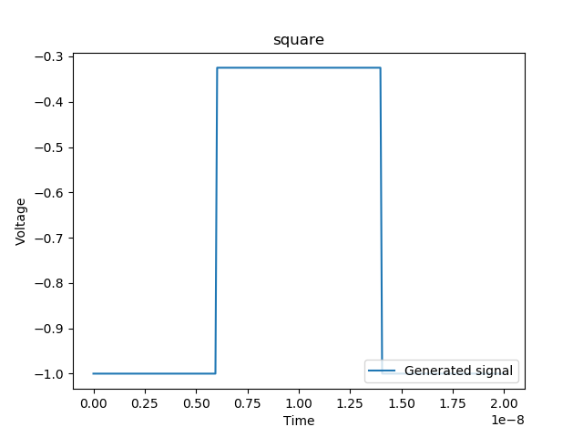
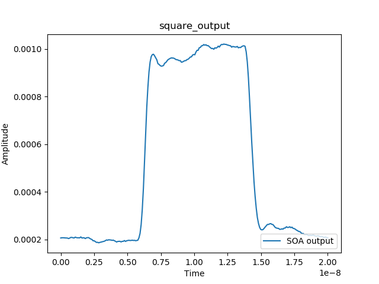
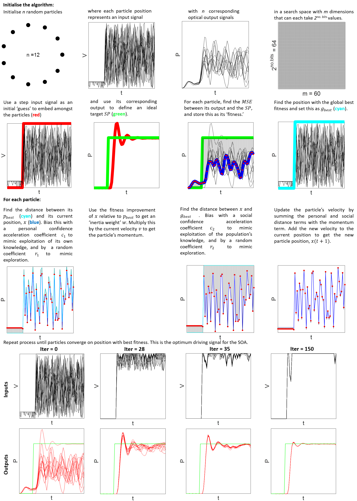
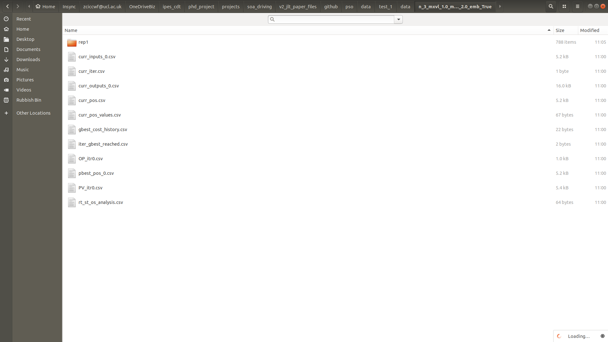
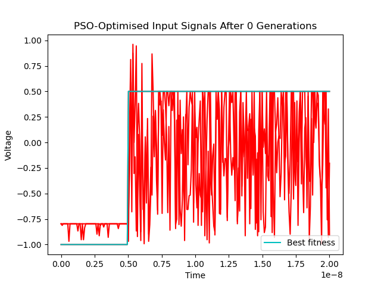
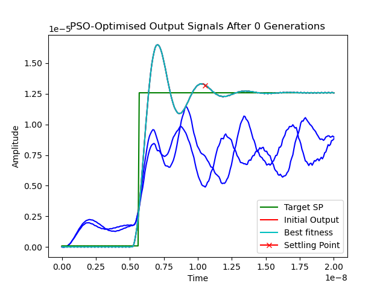
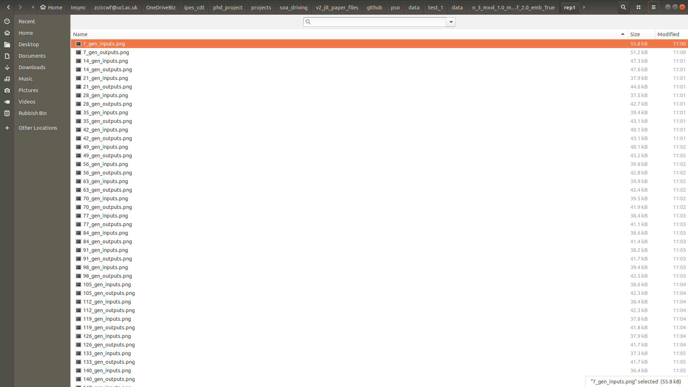
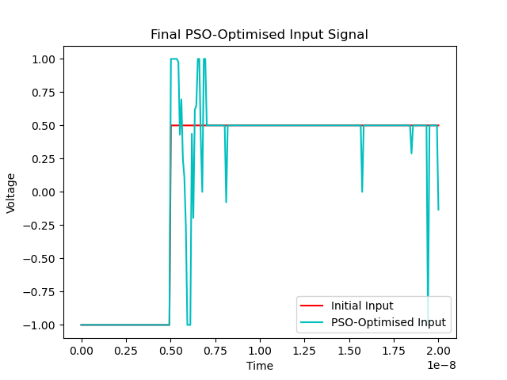
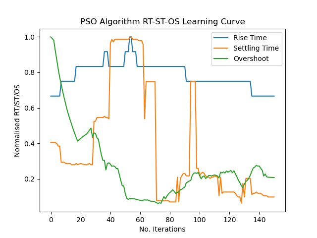

Tutorial
========
This tutorial can help you get started with using this Python package to
optimise semiconductor optical amplifiers (SOAs) with particle swarm optimisation (PSO).

Pre-requisites (key concepts described in the following such as what rise time,
settling time, overshoot, dynamic PSO, transfer functions etc. will not
be re-explained in this tutorial):

- `An Artificial Intelligence Approach to Optimal Control of Sub-Nanosecond SOA-Based Optical Switches <https://ieeexplore.ieee.org/document/9124678?arnumber=9124678>`_ (and any references in the paper not recognised by the reader)
- Chapter 16 of S. Kiranyaz's 2014 book 'Particle Swarm Optimisation'
- Basic Python

Introduction
------------

SOA Switch Optimisation
^^^^^^^^^^^^^^^^^^^^^^^
Particle Swarm Optimisation (PSO) is a metaheuristics used to solve a range of
optimisation problems, and falls under the broad category of 'artificial intelligence'
techniques. For an excellent in-depth summary, see chapter 16 of S. Kiranyaz's 
2014 book 'Particle Swarm Optimisation'. 

Semiconductor optical amplifiers (SOAs) are devices which, given (1) an electronic
driving signal and (2) an optical input signal, will amplify the light signal by
a combination of spontaneous and stimulated emission. This allows SOAs to act as
a `switch` capable of switching light on and off. Light is a popular medium in which
to communication information owing to its associated high bandwidth, energy efficiency, speed
and equipment costs. However, to communicate with light, you must be able to switch
and change the properties of your light signal. For certain applications, such as
next-generation optical circuit switched data centre networks, the `speed` with which
you can switch light signals is extremely important. It turns out that SOAs are
excellent for switching light quickly, with theoretical switching speeds limited
only by their ~100 pico- (10^-12) second excitation times. However, due to
instability issues, this switching speed is in practice much slower (on the nano- 
(10^-9) second scale), which is too slow for many desirable applications.

To help fix instability issues and improve SOA switching times, researchers need
to `optimise` their SOA. Optimisation can come in two forms; optimising the physical
properties of the SOA and its surrounding setup, `or` optimising the electronic
drive signal passed into the SOA in order to turn the SOA 'on'. The most basic
electronic drive signal to apply is the `step` drive signal:

However, this simple signal results in the following unstable optical output, resulting
in nanosecond-scale switching times:

To remedy this, researchers previously attempted to apply a range of different electronic
drive signals, from standard PID solutions from control theory to carefuly tuned
PISIC and MISIC formats. However, none of these solutions proved to work sufficiently
well to achieve sub-nanosecond (hundred-picosecond scale) switching, and none
were scalable to the thousands/millions of SOAs each with different properties that you would 
find in a real optical communication network such as a data centre.

PSO Applied to SOA Drive Signal Optimisation
^^^^^^^^^^^^^^^^^^^^^^^^^^^^^^^^^^^^^^^^^^^^

To help solve this short-coming in SOA drive signal optimisation, this package uses
a particle swarm optimisation approach to optimising the electronic drive signal
put into the SOA. The below figure is a step-by-step visualisation of how PSO was applied to the problem of SOA 
drive signal optimisation at the most basic level. 

The paper implements a couple of other key ideas such as the concept of a PISIC
shell to reduce the PSO algorithm's search space and dynamic PSO, however the above
is a succinct visualisation of the core idea.

Running Simulations
-------------------------
.. note::
    As mentioned, this PSO code has not been cleanly implemented for the most part and is not actively maintained.
    There are definitely better ways of constructing it. This tutorial is intended
    to help you get started with the code and understand how PSO can be used to 
    optimise SOAs. You are encouraged to fork the project and re-write parts/add
    functionality as you see fit. Contact cwfparsonson@gmail.com if you are interested
    in merging your code.

.. note::
    In the below examples, to save time, only ``n = 3`` particles have been used.
    Having such a low number of particles allows for short optimsation times, but
    will signficantly reduce the efficacy of the final optimal solution. To find
    better solutions, you should increase the number of particles. If you change
    certain hyperparameters, you may also need to change e.g. the number of particles.
    For example, increasing the number of dimensions (i.e. number of points) in the
    particles/drive signals will increase the size of the search space and therefore
    also likely require more particles to find sufficiently good solutions.

A Walkthrough Example
^^^^^^^^^^^^^^^^^^^^^

In this example, you will see how to use PSO to optimise the driving signals for 10 different 
SOAs by simulating 10 different transfer functions.

In your Python script, start by importing the following core functionalities from the soa module:

.. nbplot::

    from soa import devices, signalprocessing, analyse, distort_tf
    from soa.optimisation import PSO, run_test
    
The purpose of each of the above is the following:

- ``devices.py``: Module for interfacing with the SOA experimental setup (**not needed if only using transfer function simulations**)
- ``signalprocessing.py``: Module for generating standard literature SOA driving signals (e.g. PISIC, MISIC, etc.) and for evaluating optical response cost in terms of e.g. mean squared error
- ``analyse.py``: Module for analysing signal performance and retrieving optical output signal metrics (e.g. rise time, settling time, overshoot etc.)
- ``distort_tf.py``: Module for distorting the original SOA transfer function to generate new transfer functions and therefore simulate different SOAs (useful for testing the generalisability of your optimisation method(s))
- ``optimisation.py``: The main module that holds the ``PSO`` class (the key class with the PSO algorithm, send & receive functionality for drive & optical signal(s) respectively, plotting, etc.) and the ``run_test`` function, which is a function used for multiprocessing (running multiple PSO experiments in parallel - not required but recommended to speed up your tests).

.. note::
    Use the above as a guide for when you want to add more functionality/find 
    a specific function being used by this ``soa`` package/see how things work etc. 
    Feel free to add to, rewrite or replace any of the above modules/functions/methods/classes.`

Import any other useful packages you'd like to use

.. nbplot::
    
    import numpy as np
    import multiprocessing
    import pickle
    from scipy import signal
    import os
    import matplotlib.pyplot as plt

Create a folder on your local machine in which to store your PSO/SOA data and
create a ``directory`` variable with the path to this folder:

.. nbplot::

    directory = '../data/'

Initialise the basic parameters of the input and output signal you want to optimise:

.. nbplot::

    num_points = 240 # number of points in the signal (corresponds to number of dimensions *m* for each particle)
    time_start = 0 # time at which signal period should begin
    time_stop = 20e-9 # time at which signal period should end
    t = np.linspace(time_start, time_stop, num_points) # time axis of all signals

Configure the basic PSO hyperparameters:

.. nbplot::

    n = 3 # number of particles (i.e. number of signals)
    iter_max = 150 # maximum number of iterations to perform before stopping the PSO algorithm
    rep_max = 1 # number of times to repeat PSO optimisation
    max_v_f = 0.05 # maximum velocity factory by which to multiply the maximum parameter values by to get the maximum particle velocity for each iteration
    init_v_f = max_v_f # factor by which to multiply initial positions by to get initial velocity for first iteration
    cost_f = 'mSE' # cost function to use to evaluate performance. Must be 1 of: 'mSe', 'st', 'mSE+st', 's_mse+st', 'mse+st+os', 'zlpc' 
    w_init = 0.9 # initial intertia weight value (0 <= w <= 1)
    w_final = 0.5 # final inertia weigth value (0 <= w <= 1)
    on_suppress_f = 2.0 # factor by which to multiply initial guess by when in 'off' state and add to this to get space constraint

Define the initial drive signal (e.g. a step):

.. nbplot::

    init_OP = np.zeros(num_points) # initial drive signal (e.g. a step)
    init_OP[:int(0.25*num_points)],init_OP[int(0.25*num_points):] = -1, 0.5

Define the SOA(s) transfer function(s) you want to optimise for (N.B. init_OP
must have a low point of -1 for the transfer function):

.. nbplot::
    # initial transfer function numerator and denominator coefficients
    num = [2.01199757841099e85]
    den = [
        1.64898505756825e0,
        4.56217233166632e10,
        3.04864287973918e21,
        4.76302109455371e31,
        1.70110870487715e42,
        1.36694076792557e52,
        2.81558045148153e62,
        9.16930673102975e71,
        1.68628748250276e81,
        2.40236028415562e90,
    ]
    tf = signal.TransferFunction(num, den)
    tfs, _ = distort_tf.gen_tfs(num_facs=[1.0,1.2,1.4], 
                            a0_facs=[0.8],
                            a1_facs=[0.7,0.8,1.2],
                            a2_facs=[1.05,1.1,1.2],
                            all_combos=False)
    
Get the initial output of the initial transfer function and derive the target set point 
that you want to optimise towards as your target:

.. nbplot::
    init_PV = distort_tf.getTransferFunctionOutput(tf,init_OP,t)
    sp = analyse.ResponseMeasurements(init_PV, t).sp.sp

Run your experiments in parallel using the multiprocessing functionality provided by ``run_test``:

.. nbplot::
    pso_objs = multiprocessing.Manager().list()
    jobs = []
    test_nums = [test+1 for test in range(len(tfs))]
    direcs = [directory + '/test_{}'.format(test_num) for test_num in test_nums]
    for tf, direc in zip(tfs, direcs):
        if os.path.exists(direc) == False:
            os.mkdir(direc)
        p = multiprocessing.Process(target=run_test, 
                                    args=(direc, 
                                          tf, 
                                          t, 
                                          init_OP, 
                                          n, 
                                          iter_max, 
                                          rep_max, 
                                          init_v_f, 
                                          max_v_f, 
                                          w_init, 
                                          w_final, 
                                          True, 
                                          'pisic_shape', 
                                          on_suppress_f, 
                                          True, 
                                          None, 
                                          cost_f, 
                                          None, 
                                          True, 
                                          True,
                                          sp, 
                                          pso_objs,))

        jobs.append(p)
        p.start()
    for job in jobs:
        job.join()

Pickle your PSO objects so you can re-import and analyse them later:

.. nbplot::
    PIK = directory + '/pickle.dat'
    data = pso_objs
    with open(PIK, 'wb') as f:
        pickle.dump(data, f)

Pulling all of the above together, your script should look something like:

.. literalinclude:: scripts/tutorial_script_1.py

Run the above by executing your Python script. Some information will be printed
out in your terminal telling you how many iterations have passed and how much
the 'cost' (in the above example, the mean squared error) has been reduced by 
so far. 

.. note::
    Since the above example uses multiprocessing by running the 10 tests
    in parallel, the information will be printed out to your terminal in parallel,
    which is quite messy. Feel free to go into the PSO code in ``optimisation.py`` and organise this
    to improve the message printed out (if any message at all).
    
In your ``directory`` path, you should now have a folder for each of the tests
you ran (in the above example, you used multiprocessing to run a PSO optimisation
for 10 different transfer functions (SOAs) in parallel, so you have 10 test folders
(one for each test you ran)). You should also have the PSO objects saved as a 
pickle so that you can re-load them later if needed.

.. image:: images/folder_image.png
    :align: center

In each test file, there is a data folder which contains a folder whose name
is automatically determined by the hyperparameters you used. Inside this folder
is some key data:

The data saved is either a ``.png`` file (for quick visualisation of what your 
PSO run has done) or a ``.csv`` file (for loading and analysing yourself). In the 
above folder, the key data are:

- ``0_gen_inputs.png``: The input driving signals at the 0th generation of the PSO i.e. before any optimisation has begun (as described in the paper, we embed a particle whose position is equivalent to a step driving signal, which initially will be better than all other particles since other particle positions are randomly initialised (within the PISIC shell constrained area)). In the above example, we used ``n = 3`` particles, therefore there are 3 driving signals (and a 4th driving signal, which is the embedded step signal)

- ``0_gen_outputs.png``: The corresponding output driving signals of the 0th generation particles

For each repetition of the PSO, there will be a ``rep_X`` folder. Since you set
``rep_max = 1`` in the above example, there is only one repetition folder, ``rep_1``.
Inside this ``rep_1`` folder are they key PSO data. 

Again, the raw data is saved as a ``.csv`` file, and some ``.png`` images are 
saved for quick visualisation of the PSO optimisation process. In the above folder,
the PSO class was configured to save data every 7 generations. Some of the key data
saved includes:

- ``X_gen_inputs``: Particle (driving signal) positions at generation X
- ``X_gen_outputs``: Corresponding SOA optical output in response to particle driving signals at generation X
- ``curr_inputs_X``: Raw data of particle positions at generation X (useful to save incase PSO crashes and want to resume without having to start over)
- ``curr_outputs_X``: Raw data of corresponding optical outputs of particle positions
- ``final_input``: The final 'optimal' driving signal found by the PSO optimisation process after finishing all iterations
- ``final_output``: The corresponding SOA optical output of the final optimal driving signal
- ``final_learning_curve``: How the 'cost' (in the above example, the mean squared error) varied with the number of PSO iterations
- ``g_best_cost_history``: The global best costs that were found across all iterations
- ``iter_gbest_reached``: The corresponding iteration that each global best cost value was found at (use these data to plot cost curves)
- ``initial_OP``: The initial driving signal (in the above example, a step driving signal)
- ``initial_PV``: The corresponding optical output of the initial driving signal
- ``optimised_OP``: The final optimised driving signal found by the PSO
- ``optimised_PV``: The corresponding optical output of the final optimsed driving signal
- ``pbest_post_X``: The personal best position found by each particle at iteration X
- ``rt_st_os_analysis``: The rise time, settling time, overshoot, and settling time index (i.e. the index in the output signal at which the signal was registered as having settled) of the best particle's corresponding optical output at each iteration of the PSO
- ``rtstos_learning_curve``: Hoe rise time, settling time and overshoot varied across iterations
- ``SP``: The target set point that was used as the target SOA optical output signal that the PSO was trying to achieve (in the above example, a step signal with 0 rise time, settling and rise time generated from the initial PV)
- ``time``: The time axis used by all signals

Looking at what the PSO did in the above examples, you can see that it converged
on an interesting final driving signal with an improved corresponding optical output
signal:

.. image:: images/final_output.png
    :align: center

This led to a significant decrease in settling time, which is usually considered
the key metric for switching time:

Additional Example Scripts
^^^^^^^^^^^^^^^^^^^^^^^^^^
Running PSO with 120, 140, 160, 180, 200, 220 and 240 dimensions (number of points in the drive signal):

.. literalinclude:: scripts/tutorial_script_2.py

Overview of Backend PSO and SOA Code
------------------------------------

The following Python files make up the backend of this package:

- ``devices.py``: Module for interfacing with the SOA experimental setup (**not needed if only using transfer function simulations**)
- ``signalprocessing.py``: Module for generating standard literature SOA driving signals (e.g. PISIC, MISIC, etc.) and for evaluating optical response cost in terms of e.g. mean squared error
- ``analyse.py``: Module for analysing signal performance and retrieving optical output signal metrics (e.g. rise time, settling time, overshoot etc.)
- ``distort_tf.py``: Module for distorting the original SOA transfer function to generate new transfer functions and therefore simulate different SOAs (useful for testing the generalisability of your optimisation method(s))
- ``optimisation.py``: The main module that holds the ``PSO`` class (the key class with the PSO algorithm, send & receive functionality for drive & optical signal(s) respectively, plotting, etc.) and the ``run_test`` function, which is a function used for multiprocessing (running multiple PSO experiments in parallel - not required but recommended to speed up your tests).

You are encouraged to change the code in these, add new functionality, re-write parts
etc. Each file has reasonably good comments and you should be able to follow the code.
``optimisation.py`` is the key file which holds the PSO code, so this is likely the file
you will want to become most familiar with.

